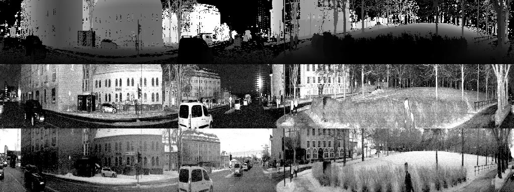

# :computer: neural-vision
---
In my final project of [TDT4265](https://www.ntnu.edu/studies/courses/TDT4265#tab=omEmnet), my goal is to detect objects in traffic from LIDAR images collected around the NTNU campus. The sample image below is an example of how the dataset looks like.

> The image is a three-channel image from a 360&deg; 128-channel LIDAR. The image is separated into depth of the scene (top row), ambience, and intensity (the return of the laser beam, bottom row). The images have a resolution of 128 × 1024 and are stored as 8-bit 3-channel images.

## :recycle: Development Cycle

- Dataset exploration and annotation
- Model development
- Model evaluation
- ”Going Beyond”

### :clipboard: Tasks

- [ ] Part 1. Dataset Exploration (9 points)
  - [ ] Task 1.1 (6 points) - Getting to know your dataset
  - [ ] Task 1.2 (3 points) - Annotating Data
- [ ] Part 2. Model Creation (23 points)
  - [ ] Task 2.1. (2 points) - Creating your first baseline
  - [ ] Task 2.2 (3 points) - Augmenting the Data
  - [ ] Task 2.3. (11 points) - Implementing RetinaNet.
  - [ ] Task 2.4 (5 points) - Using the Exploration Knowledge
  - [ ] Task 2.5 (2 points) - Extending the Dataset
- [ ] Part 3. Discussion and Evaluation (12 points)
  - [ ] Task 3.1 (5 points) - Quantitative Analysis
  - [ ] Task 3.2 (5 points) - Discussion and Qualitative Analysis
  - [ ] Task 3.3 (2 points) - Final Discussion
  - [ ] Task 3.4 (0 points) - Leaderboard Submission
- [ ] Part 4. Going beyond (6 points)
  - [ ] Task 4.1 - Implementing BiFPN
  - [ ] Task 4.2 - Explaining the Model with CAM
  - [ ] Task 4.3 - Following your own idea
  - [ ] Task 4.4 - Comparing to State-of-the-Art

### :mailbox: Deliverables

- Report
- Video
- Code
