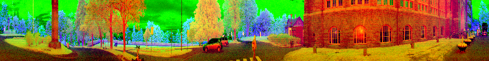
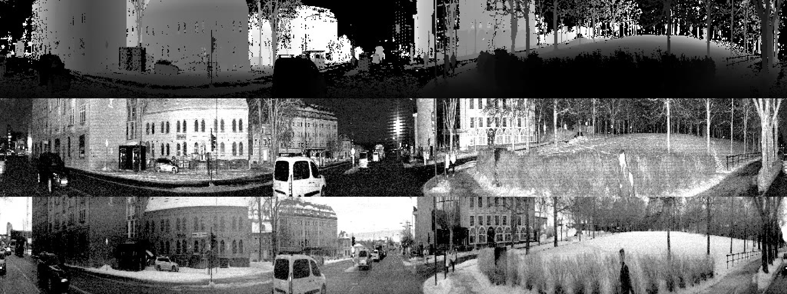

# :computer: neuralvision

---

In my final project of [TDT4265](https://www.ntnu.edu/studies/courses/TDT4265#tab=omEmnet), my goal is to detect objects in traffic from LIDAR images collected around the NTNU campus.

> This image is an example of how the dataset looks like.  
> The image is a three-channel image from a 360&deg; 128-channel LIDAR.
> 

> The image is separated into depth of the scene (top row), ambience, and intensity (the return of the laser beam, bottom row). The images have a resolution of 128 × 1024 and are stored as 8-bit 3-channel images.
> 

## :recycle: Development Cycle

- Dataset exploration and annotation
- Model development
- Model evaluation
- ”Going Beyond”

### :clipboard: Tasks
See  for more information.

### :mailbox: Deliverables

- Report
- Video
- Code
